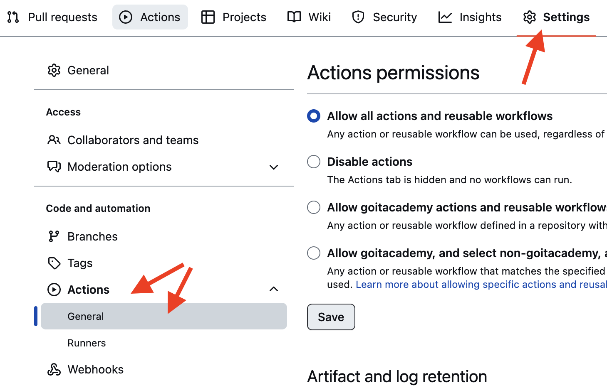
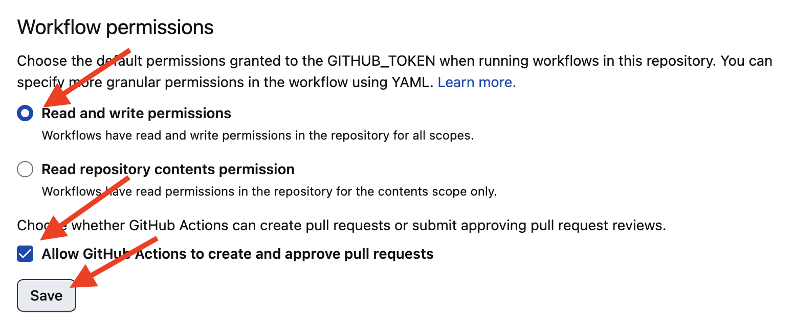

# React homework template

Acest proiect a fost creat cu ajutorul
[Create React App](https://github.com/facebook/create-react-app). Pentru prezentări
și configurarea de funcții suplimentare
[consultați documentația](https://facebook.github.io/create-react-app/docs/getting-started).

## Crearea unui repository dintr-un șablon

Utilizați acest repository al organizației GoIT ca model pentru crearea unui repository
pentru proiectul dumneavoastră. Pentru a face acest lucru, faceți clic pe "Use this template" și selectați opțiunea
"Create a new repository", așa cum se arată în imagine.

Următorul pas va deschide pagina de creare a unui nou repository. Completați câmpul
pentru numele acestuia, asigurați-vă că repository-ul este public, apoi faceți clic pe
«Create repository from template».

Odată ce repository-ul a fost creat, trebuie să accesați setările
ale repository-ului creat în fila Settings > Actions > General, așa cum urmează
prezentată în imagine.

După ce ați derulat până la sfârșitul paginii, în secțiunea "Workflow permissions", selectați
Read and write permissions" (Permisiuni de citire și scriere) și bifați caseta de selectare. Acest lucru
este necesar pentru a automatiza procesul de lansare a proiectului.

Aveți acum un repository personal de proiecte, cu o structură de fișiere și dosare.
Lucrați apoi cu acesta așa cum ați face-o cu orice alt repository personal,
clonați-l pe computerul dumneavoastră, scrieți codul, confirmați-l și încărcați-l pe
GitHub.

## Pregătirea pentru muncă

1. Asigurați-vă că aveți versiunea LTS a Node.js instalată pe computerul dumneavoastră.
   [Descărcați-o și instalați-o](https://nodejs.org/en/) dacă este necesar.
2. Instalați dependențele de bază ale proiectului cu ajutorul comenzii npm install.
3. Porniți modul de dezvoltare prin rularea comenzii npm start.
4. Accesați [http://localhost:3000](http://localhost:3000) în browserul dumneavoastră.
   Această pagină se va reîncărca automat după salvarea modificărilor aduse la
   fișiere de proiect.

## Deploy

Versiunea de producție a proiectului va fi automat legată, construită și
distribuită pe GitHub Pages, în ramura gh-pages, de fiecare dată când se va lansa proiectul.
ramura main este actualizată. De exemplu, după un push direct sau o cerere de pull-request acceptată. Pentru a face acest lucru
În fișierul package.json, editați câmpul homepage înlocuind
your_username și your_repo_name cu numele dvs. propriu și trimiteți modificările la GitHub.

json
"homepage": "https://your_username.github.io/your_repo_name/"

În continuare, mergeți la setările repository-ului GitHub (`Settings` > `Pages`) și
setați să distribuiți versiunea de producție a fișierelor în folderul /root al ramurii gh-pages, dacă
acest lucru nu a fost făcut în mod automat.

### Deployment status

Starea de implementare a ultimei comenzi este indicată de o pictogramă în dreptul ID-ului său.

- Galben - Proiectul este în curs de construire și de desfășurare.
- Verde - Implementarea s-a finalizat cu succes.
- Roșu - A apărut o eroare în timpul legării, construirii sau desfășurării.

Informații mai detaliate privind starea pot fi vizualizate făcând clic pe pictogramă, iar în fereastra
clic pe link-ul Details din fereastra derulantă.

### Pagina live

După un timp, de obicei câteva minute, pagina live poate fi vizualizată.
la adresa specificată în proprietatea homepage editată. De exemplu, iată
link către versiunea live pentru acest depozit
[https://goitacademy.github.io/react-homework-template](https://goitacademy.github.io/react-homework-template).

Dacă se deschide o pagină goală, asigurați-vă că nu există erori în fila Console.
asociate cu căi de acces incorecte la fișierele CSS și JS ale proiectului (**404**). Cel mai probabil
Probabil că aveți o valoare greșită pentru proprietatea homepage din fișierul package.json.

### Rutarea

Dacă aplicația utilizează biblioteca react-router-dom pentru rutare,
Trebuie să configurați suplimentar componenta <BrowserRouter>` prin trecerea în prop
basename numele exact al repository-ului dumneavoastră. O bară oblică la începutul liniei este obligatorie.

jsx
<BrowserRouter basename="/your_repo_name">
  <App />
</BrowserRouter>

## Cum funcționează

1. După fiecare "push" către ramura main a depozitului GitHub, se va crea un fișier special
   script (GitHub Action) din fișierul .github/workflows/deploy.yml.
2. Toate fișierele din repository sunt copiate pe server, unde proiectul este inițializat și construit înainte de a fi implementat.
3. Dacă toți pașii sunt reușiți, versiunea de producție asamblată a fișierelor proiectului
   este trimisă la ramura gh-pages. În caz contrar, jurnalul de execuție al scriptului
   scriptului va indica care este problema.
