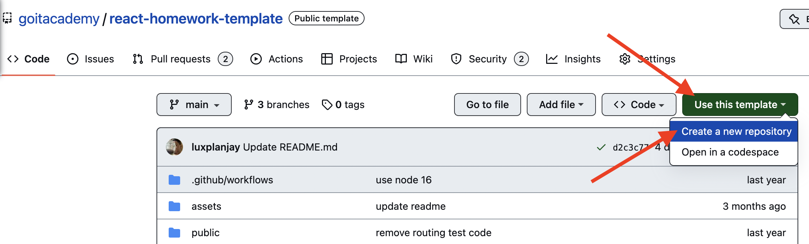
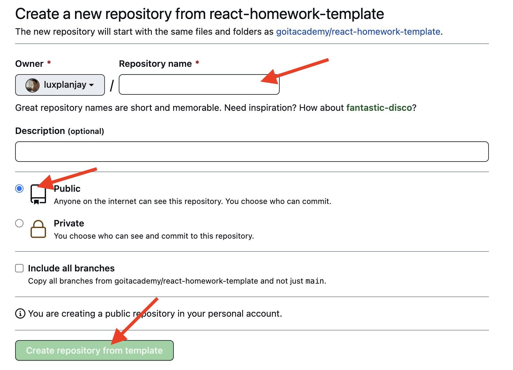

# React homework template

Este proyecto fue creado con la ayuda de
[Create React App](https://github.com/facebook/create-react-app).
[Consulte la documentación](https://facebook.github.io/create-react-app/docs/getting-started)
para familiarizarse con las funciones opcionales y configurarlas.

## Создание репозитория по шаблону

Используй этот репозиторий организации GoIT как шаблон для создания репозитория
своего проекта. Для этого нажми на кнопку `«Use this template»` и выбери опцию
`«Create a new repository»`, как показано на изображении.



На следующем шаге откроется страница создания нового репозитория. Заполни поле
его имени, убедись что репозиторий публичный, после чего нажми кнопку
`«Create repository from template»`.



Теперь у тебя есть личный репозиторий проекта, со структурой файлов и папок
репозитория-шаблона. Далее работай с ним как с любым другим личным репозиторием,
клонируй его себе на компьютер, пиши код, делай коммиты и отправляй их на
GitHub.

## Подготовка к работе

1. Asegúrate de que la versión LTS de Node.js está instalada en tu computador.
   [Descárguela e instálela](https://nodejs.org/en/) de ser necesario.
2. Instala las dependencias base del proyecto con el comando `npm install`.
3. Inicia el modo de desarrollo ejecutando el comando `npm start`.
4. En tu navegador, ve a la dirección
   [http://localhost:3000](http://localhost:3000). Esta página se recargará
   automáticamente después de guardar los cambios en los archivos del proyecto.

## Implementación

La versión de producción del proyecto se verificará, compilará y desplegará
automáticamente en GitHub Pages, en la rama `gh-pages`, cada vez que se
actualice la rama `main`. Por ejemplo, después de un Push directo o de una
Pool-request aceptada. Para ello, edita el campo `homepage` del archivo
`package.json`, sustituyendo `your_username` y `your_repo_name` por los tuyos
propios, y envía los cambios a GitHub.

```json
"homepage": "https://your_username.github.io/your_repo_name/"
```

A continuación, ve a la configuración del repositorio de GitHub (`Settings` >
`Pages`) y selecciona distribuir la versión de producción de los archivos desde
la carpeta `/root` de la rama `gh-pages`, si no se ha hecho automáticamente.


### Estado de la implantación

El estado del último commit se indica con un icono junto al ID del commit.

- **Color amarillo** - el proyecto está compilado e implementado.
- **Color verde** - La implementación se completó con éxito.
- **Color rojo** - Se ha producido un error durante la verificación, la
  compilación o la implementación

Se puede ver información de estado más detallada haciendo clic en el icono y en
la ventana desplegable del enlace `Detalles`.


### Página activa

Después de un tiempo, normalmente un par de minutos, la página real se puede ver
en la dirección especificada en la propiedad `homepage`. Por ejemplo, aquí está
el enlace a la versión activa de este repositorio
[https://goitacademy.github.io/react-homework-template](https://goitacademy.github.io/react-homework-template).

Si se abre una página en blanco, asegúrate de que no haya errores en la pestaña
`Console` relacionados con rutas incorrectas de archivos CSS y JS del proyecto
(**404**). Probablemente tienes un valor incorrecto para la propiedad `homepage`
en el archivo `package.json`.

### Enrutamiento

Si la aplicación utiliza la librería `react-router-dom` para el enrutamiento, el
componente `<BrowserRouter>` debe ser configurado adicionalmente pasando en la
prop `basename`, el nombre exacto de tu repositorio. Las barras inclinadas al
principio y al final de la cadena son obligatorias.

```jsx
<BrowserRouter basename="/your_repo_name/">
  <App />
</BrowserRouter>
```

## ¿Cómo funciona?


1. Después de cada push a la rama `main` del repositorio GitHub, se ejecuta un
   script especial (GitHub Action) del archivo `.github/workflows/deploy.yml`.
2. Todos los archivos del repositorio se copian en el servidor, donde el
   proyecto se inicializa, se verifica y se compila antes de ser implementado.
3. Si todos los pasos tienen éxito, la versión de producción compilada de los
   archivos del proyecto se envía a la rama `gh-pages`. De lo contrario, el
   registro de ejecución del script indicará cuál es el problema.
