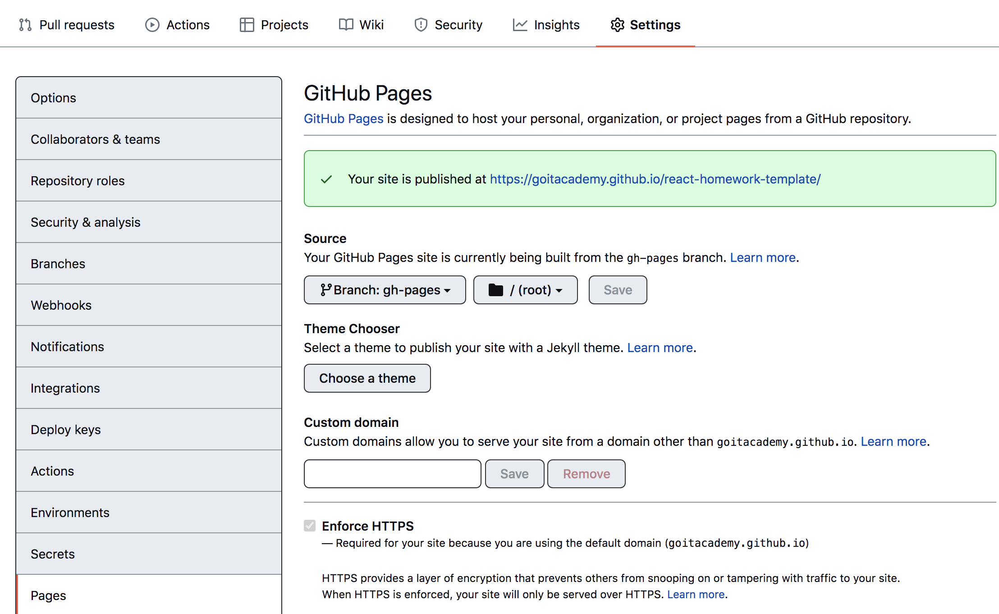

# react-homework-template

## Скрытые файлы

Включите отображение скрытых файлов и папок в проводнике своей операционной
системы, иначе вы не сможете выбрать и скопировать служебные файлы настроек
проекта.

## Create React App

This проект was bootstrapped with
[Create React App](https://github.com/facebook/create-react-app). You can learn
more in the
[Create React App documentation](https://facebook.github.io/create-react-app/docs/getting-started).
In the project directory, you can run next set of predefined scripts.

## Перед началом работы

Установить все базовые зависимости проекта.

```shell
npm install
```

## Разработка

Запустить режим разработки.

```shell
npm start
```

Runs the app in the development mode. Open
[http://localhost:3000](http://localhost:3000) to view it in your browser.

The page will reload when you make changes. You may also see any lint errors in
the console.

## Деплой

Продакшн версия проекта будет автоматически собираться и деплоиться на GitHub
Pages, в ветку `gh-pages`, каждый раз когда обновляется ветка `main`. Например,
после прямого пуша или принятого пул-реквеста. Для этого необходимо в файле
`package.json` отредактировать поле `homepage`, заменив `your_username` и
`your_repo_name` на свои.

```json
"homepage": "https://your_username.github.io/your_repo_name/"
```

На всякий случай стоит зайти на GitHub в настройки репозитория (`Settings` >
`Pages`) и убедиться что продакшн версии файлов раздаются из папки `/root` ветки
`gh-pages`.



### Статус деплоя

Статус деплоя крайнего коммита отображается иконкой возле его идентификатора.

- Желтый цвет - выполняется сборка и деплой проекта.
- Зеленый цвет - деплой завершился успешно.
- Красный цвет - во время сборки или деплоя произошла ошибка.

Более детальную информацию о статусе можно посмотреть кликнув по иконке, и в
выпадающем окне перейти по ссылке `Details`.


### Живая страница

Через какое-то время живую страницу можно будет посмотреть по адресу указанному
в отредактированном свойстве `homepage`, например
[https://goitacademy.github.io/react-homework-template](https://goitacademy.github.io/react-homework-template).

### Маршрутизация

Если приложение использует библиотеку `react-router-dom` для маршрутизации,
необходимо дополнительно настроить компонент `<BrowserRouter>`, передав в пропе
`basename` точное название вашего репозитория. Слеши в начале и конце строки
обязательны.

```jsx
<BrowserRouter basename="/your_repo_name/">
  <App />
</BrowserRouter>
```
